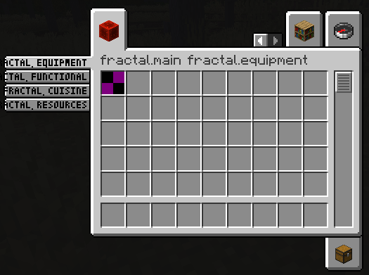
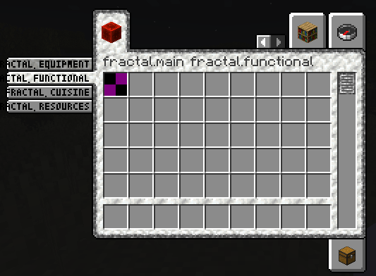

# About Fractal
This repo is a fork of [lib39/fractal](https://git.sleeping.town/unascribed-mods/Lib39) by unascribed, with added support for styled groups. I will take care of this repo while unascribed is busy.

Fractal introduces item **subgroups for the creative menu**.

### Why Fractal?

- Fractals Subgroups are very condensed, allowing you to add SubTab to each of your tabs
- Creating a new SubTab only takes one line of code and no changes in the way you assign your items to tabs. Just pass
  them the CreativeSubTab instead of your main CreativeModeTab

### Limitations

- More than 12 SubTabs per item group, while fully functional, will look weird

# How to Use

### Where to get

You can find Fractal in:

```gradle
repositories {
	maven { url = "https://maven.is-immensely.gay/releases" }
}

dependencies {
	modImplementation include("de.dafuqs:fractal:${project.fractal_version}")
}
```

or get it from the Modrinth Maven:

```gradle
repositories {
	maven { url = "https://api.modrinth.com/maven" }
}

dependencies {
	modImplementation include("maven.modrinth:fractal-lib:${project.fractal_version}")
}
```

## Example Implementation

### Vanilla Style Subgroups



```java
public static final Identifier GROUP_ID = Identifier.fromNamespaceAndPath("mymod", "main");

public static final CreativeModeTab MAIN = FabricItemGroup.builder()
		.icon(() -> new ItemStack(Blocks.REDSTONE_BLOCK))
		.displayItems((itemDisplayParameters, output) -> {
			for (CreativeSubTab subGroup : Fractal.MAIN.fractal$getChildren()) {
				output.acceptAll(subGroup.getSearchTabDisplayItems(), CreativeModeTab.TabVisibility.PARENT_AND_SEARCH_TABS);
			}
		})
		.title(Component.translatable("mymod.1"))
		.hideTitle()
		.build();

public static final CreativeModeTab EQUIPMENT = new CreativeSubTab.Builder(MAIN, Identifier.fromNamespaceAndPath("mymod", "equipment"), Component.translatable("itemGroup.mymod.equipment")).entries((displayContext, entries) -> entries.accept(Items.APPLE)).build();
public static final CreativeModeTab FUNCTIONAL = new CreativeSubTab.Builder(MAIN, Identifier.fromNamespaceAndPath("mymod", "functional"), Component.translatable("itemGroup.mymod.functional")).entries((displayContext, entries) -> entries.accept(Items.BAKED_POTATO)).build();
public static final CreativeModeTab CUISINE = new CreativeSubTab.Builder(MAIN, Identifier.fromNamespaceAndPath("mymod", "cuisine"), Component.translatable("itemGroup.mymod.cuisine")).entries((displayContext, entries) -> entries.accept(Items.CACTUS)).build();
public static final CreativeModeTab RESOURCES = new CreativeSubTab.Builder(MAIN, Identifier.fromNamespaceAndPath("mymod", "resources"), Component.translatable("itemGroup.mymod.resources")).entries((displayContext, entries) -> entries.accept(Items.DANDELION)).build();


@Override
public void onInitialize() {
	Registry.register(BuiltInRegistries.CREATIVE_MODE_TAB, GROUP_ID, MAIN);
}

```

### Applying a custom style
You are also able to apply a style to your ItemSubGroups, by supplying custom background, tab, subtab and scrollbar textures. You can even mix and match!
In this example, the first two ItemSubGroups use a custom style by supplying texture files that are being shipped with your mod. The latter two tabs use the vanilla style.



```java
// Texture (put into \resources\assets\fractal\textures\gui\container\creative_inventory)
public static final Identifier BACKGROUND_TEXTURE = Identifier.fromNamespaceAndPath("fractal", "textures/gui/container/creative_inventory/custom_background.png");

// Sprites (put into \resources\assets\fractal\textures\gui\sprites\container\creative_inventory)
public static final Identifier SCROLLBAR_ENABLED_TEXTURE = Identifier.fromNamespaceAndPath("fractal", "container/creative_inventory/custom_scrollbar_enabled");
public static final Identifier SCROLLBAR_DISABLED_TEXTURE = Identifier.fromNamespaceAndPath("fractal", "container/creative_inventory/custom_scrollbar_disabled");

public static final Identifier SUBTAB_SELECTED_TEXTURE_LEFT = Identifier.fromNamespaceAndPath("fractal", "container/creative_inventory/custom_subtab_selected_left");
public static final Identifier SUBTAB_UNSELECTED_TEXTURE_LEFT = Identifier.fromNamespaceAndPath("fractal", "container/creative_inventory/custom_subtab_unselected_left");
public static final Identifier SUBTAB_SELECTED_TEXTURE_RIGHT = Identifier.fromNamespaceAndPath("fractal", "container/creative_inventory/custom_subtab_selected_right");
public static final Identifier SUBTAB_UNSELECTED_TEXTURE_RIGHT = Identifier.fromNamespaceAndPath("fractal", "container/creative_inventory/custom_subtab_unselected_right");

public static final Identifier TAB_TOP_FIRST_SELECTED_TEXTURE = Identifier.fromNamespaceAndPath("fractal", "container/creative_inventory/custom_tab_top_first_selected");
public static final Identifier TAB_TOP_SELECTED_TEXTURE = Identifier.fromNamespaceAndPath("fractal", "container/creative_inventory/custom_tab_top_selected");
public static final Identifier TAB_TOP_LAST_SELECTED_TEXTURE = Identifier.fromNamespaceAndPath("fractal", "container/creative_inventory/custom_tab_top_last_selected");
public static final Identifier TAB_TOP_FIRST_UNSELECTED_TEXTURE = Identifier.fromNamespaceAndPath("fractal", "container/creative_inventory/custom_tab_top_first_unselected");
public static final Identifier TAB_TOP_UNSELECTED_TEXTURE = Identifier.fromNamespaceAndPath("fractal", "container/creative_inventory/custom_tab_top_unselected");
public static final Identifier TAB_TOP_LAST_UNSELECTED_TEXTURE = Identifier.fromNamespaceAndPath("fractal", "container/creative_inventory/custom_tab_top_last_unselected");
public static final Identifier TAB_BOTTOM_FIRST_SELECTED_TEXTURE = Identifier.fromNamespaceAndPath("fractal", "container/creative_inventory/custom_tab_bottom_first_selected");
public static final Identifier TAB_BOTTOM_SELECTED_TEXTURE = Identifier.fromNamespaceAndPath("fractal", "container/creative_inventory/custom_tab_bottom_selected");
public static final Identifier TAB_BOTTOM_LAST_SELECTED_TEXTURE = Identifier.fromNamespaceAndPath("fractal", "container/creative_inventory/custom_tab_bottom_last_selected");
public static final Identifier TAB_BOTTOM_FIRST_UNSELECTED_TEXTURE = Identifier.fromNamespaceAndPath("fractal", "container/creative_inventory/custom_tab_bottom_first_unselected");
public static final Identifier TAB_BOTTOM_UNSELECTED_TEXTURE = Identifier.fromNamespaceAndPath("fractal", "container/creative_inventory/custom_tab_bottom_unselected");
public static final Identifier TAB_BOTTOM_LAST_UNSELECTED_TEXTURE = Identifier.fromNamespaceAndPath("fractal", "container/creative_inventory/custom_tab_bottom_last_unselected");

public static final CreativeSubTabStyle STYLE = new CreativeSubTabStyle.Builder()
		.background(BACKGROUND_TEXTURE)
		.scrollbar(SCROLLBAR_ENABLED_TEXTURE, SCROLLBAR_DISABLED_TEXTURE)
		.subtab(SUBTAB_SELECTED_TEXTURE_LEFT, SUBTAB_UNSELECTED_TEXTURE_LEFT, SUBTAB_SELECTED_TEXTURE_RIGHT, SUBTAB_UNSELECTED_TEXTURE_RIGHT)
		.tab(TAB_TOP_FIRST_SELECTED_TEXTURE, TAB_TOP_SELECTED_TEXTURE, TAB_TOP_LAST_SELECTED_TEXTURE, TAB_TOP_FIRST_UNSELECTED_TEXTURE, TAB_TOP_UNSELECTED_TEXTURE, TAB_TOP_LAST_UNSELECTED_TEXTURE,
				TAB_BOTTOM_FIRST_SELECTED_TEXTURE, TAB_BOTTOM_SELECTED_TEXTURE, TAB_BOTTOM_LAST_SELECTED_TEXTURE, TAB_BOTTOM_FIRST_UNSELECTED_TEXTURE, TAB_BOTTOM_UNSELECTED_TEXTURE, TAB_BOTTOM_LAST_UNSELECTED_TEXTURE)
		.build();

public static final Identifier GROUP_ID = Identifier.fromNamespaceAndPath("mymod", "main");

public static final CreativeModeTab MAIN = FabricItemGroup.builder()
		.icon(() -> new ItemStack(Blocks.REDSTONE_BLOCK))
		.displayItems((itemDisplayParameters, output) -> {
			for (CreativeSubTab subGroup : Fractal.MAIN.fractal$getChildren()) {
				output.acceptAll(subGroup.getSearchTabDisplayItems(), CreativeModeTab.TabVisibility.PARENT_AND_SEARCH_TABS);
			}
		})
		.title(Component.translatable("mymod.1"))
		.hideTitle()
		.build();

public static final CreativeModeTab EQUIPMENT = new CreativeSubTab.Builder(MAIN, Identifier.fromNamespaceAndPath("mymod", "equipment"), Component.translatable("itemGroup.mymod.equipment")).styled(STYLE).entries((displayContext, entries) -> entries.accept(Items.APPLE)).build();
public static final CreativeModeTab FUNCTIONAL = new CreativeSubTab.Builder(MAIN, Identifier.fromNamespaceAndPath("mymod", "functional"), Component.translatable("itemGroup.mymod.functional")).styled(STYLE).entries((displayContext, entries) -> entries.accept(Items.BAKED_POTATO)).build();
public static final CreativeModeTab CUISINE = new CreativeSubTab.Builder(MAIN, Identifier.fromNamespaceAndPath("mymod", "cuisine"), Component.translatable("itemGroup.mymod.cuisine")).entries((displayContext, entries) -> entries.accept(Items.CACTUS)).build();
public static final CreativeModeTab RESOURCES = new CreativeSubTab.Builder(MAIN, Identifier.fromNamespaceAndPath("mymod", "resources"), Component.translatable("itemGroup.mymod.resources")).entries((displayContext, entries) -> entries.accept(Items.DANDELION)).build();


@Override
public void onInitialize() {
	Registry.register(BuiltInRegistries.CREATIVE_MODE_TAB, GROUP_ID, MAIN);
}
```

### Adding items to existing ItemSubGroups

There exists an API for that! `CreativeSubTabEvent.modifyEntriesEvent(<Identifier of the Subtab you want to modify)`
behaves exactly like its Fabric API counterpart, but targets CreativeSubTabs instead of CreativeModeTabs (it needs to be
a separate event, since CreativeSubTabs are not registered item groups, having no RegistryEntry that the Fabric API
version targets)
